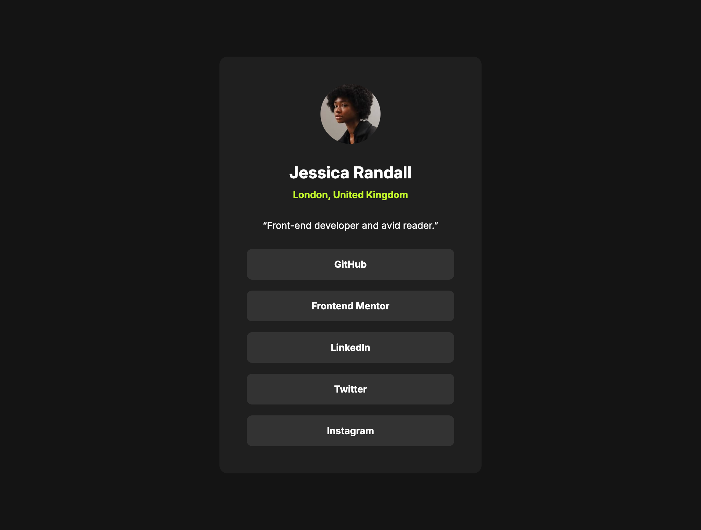

# Frontend Mentor - Social links profile solution

This is a solution to the [Social links profile challenge on Frontend Mentor](https://www.frontendmentor.io/challenges/social-links-profile-UG32l9m6dQ). Frontend Mentor challenges help you improve your coding skills by building realistic projects.

## Table of contents

- [Overview](#overview)
  - [The challenge](#the-challenge)
  - [Screenshot](#screenshot)
  - [Links](#links)
- [My process](#my-process)
  - [Built with](#built-with)
  - [What I learned](#what-i-learned)
  - [Continued development](#continued-development)
- [Author](#author)

## Overview

### The challenge

Users should be able to:

- See hover and focus states for all interactive elements on the page

### Screenshot

### Links

- Solution URL: [Add solution URL here](https://your-solution-url.com)
- Live Site URL: [Add live site URL here](https://your-live-site-url.com)

## My process

### Built with

- Semantic HTML5 markup
- [CUBE CSS](https://cube.fyi/)
- CSS custom properties
- Flexbox
- CSS Grid
- Mobile-first workflow

### What I learned

More of a "re-learning", I discovered a bug in the line-height of the card heading. It took a few minutes to remember that line-height should be unitless, so it can be calculated based on the inheriting element and not the instantiating selector.

### Continued development

I continue to be impressed with the CUBE CSS methodology. It feels efficient and natural, and aligns with how I have always preferred to write CSS.

## Author

- Frontend Mentor - [@dave-cross](https://www.frontendmentor.io/profile/dave-cross)
- Youtube - [@dave-cross](http://youtube.com/@dave-cross)
